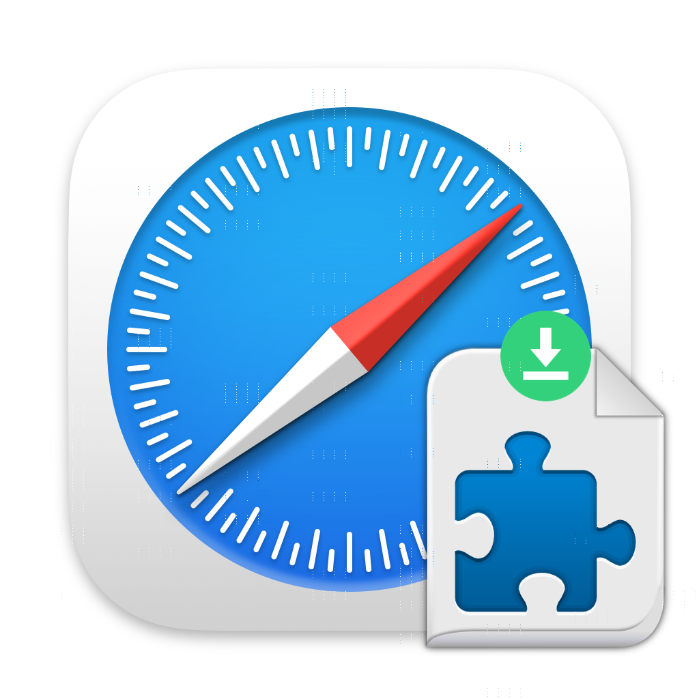

# SafariSideloader

Sideload WebExtensions from the Chrome Web Store into Safari 14.0+.

Note: Due to Safari's limited support for WebExtensions APIs as laid out in [MDN](https://developer.mozilla.org/en-US/docs/Mozilla/Add-ons/WebExtensions/Browser_support_for_JavaScript_APIs?utm_source=blog.mozilla.org&utm_medium=hacks&utm_campaign=2020-06-safari-webextensions), not all extensions from Chrome/Firefox will function in Safari. In fact, most probably won't function flawlessly without modifications from the extension developer.

Please do not report any issues with converted and sideloaded extensions to the extension developer. We are not repsonsible for any sideloaded extensions failing to work.

[Apple Developer WWDC 2020 Video on Safari WebExtensions](https://developer.apple.com/videos/play/wwdc2020/10665/)
